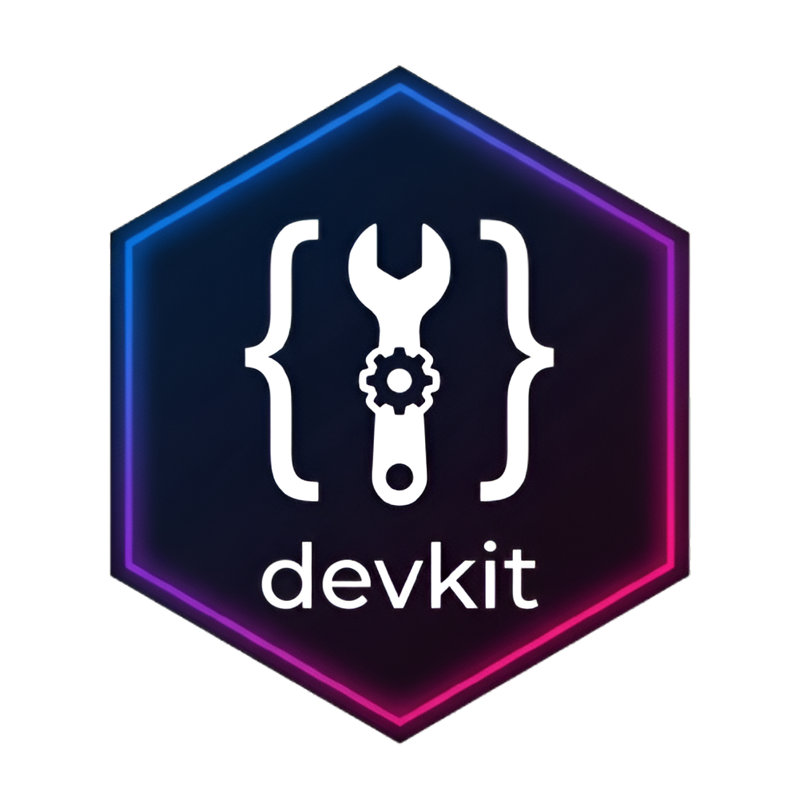

# devkit 

<!-- badges: start -->
[](https://github.com/zankrut20/devkit/actions/workflows/R-CMD-check.yaml)
[](https://zankrut20.github.io/devkit/)
[](https://lifecycle.r-lib.org/articles/stages.html)
[](https://opensource.org/licenses/MIT)
[](https://app.codecov.io/gh/zankrut20/devkit)
<!-- badges: end -->

`devkit` is a professional, zero-dependency R development toolkit designed to streamline package management, environment setup, session auditing, and batch processing. It provides a suite of utilities to help developers maintain CRAN compliance and optimize their development workflow.

## 🚀 Installation

Install the released version of `devkit` from CRAN with:

```r
install.packages("devkit")
```

Or install the development version from [GitHub](https://github.com/zankrut20/devkit) with:

```r
# install.packages("devtools")
devtools::install_github("zankrut20/devkit")
```

## 🛠️ Usage

Once installed, simply load the library to access all utilities:

```r
library(devkit)

# Example: Audit your package dependencies
audit_dependencies()

# Example: Clean up memory hogs
hunt_zombies()
```

## 📦 Toolkit Overview

### 📦 Package Management
- `audit_dependencies()`: Verifies DESCRIPTION file vs actual code usage.
- `remove_package()`: Smart package removal with orphan dependency checking.
- `remove_user_installed_packages()`: Cleans all user-installed packages while preserving base/recommended ones.
- `scan_dependencies()`: Identifies unused packages in your session.

### 🧹 Memory Management
- `sweep_memory()`: Removes large objects and triggers garbage collection.
- `hunt_zombies()`: Cleans hidden temp files and orphaned graphics devices.
- `sweep_temp_cache()`: Flushes R session caches across the system.

### 🔧 Development Environment
- `bootstrap_dev_env()`: Installs and attaches core dev tools.
- `manage_deprecation()`: Scaffolds deprecation wrappers and refactors calls.
- `setup_preflight()`: Configures Git pre-commit hooks for safety.
- `setup_sentinel()`: Enables dual-logging for session reproducibility.

### 📊 Session Management
- `audit_script()`: Snapshots session state before and after script execution.
- `detect_masking()`: Resolves namespace conflicts and function masking.
- `export_snapshot()`: Exports attached packages to an installation script.

### ⚙️ Batch Processing
- `dispatch_checkpoints()`: Crash-resilient batch processing with recovery.
- `loop_guardian()`: Memory-safe iteration with RAM monitoring.
- `network_diplomat()`: Rate-limited network requests with exponential backoff.

### 🏗️ Code Generation
- `architect_release()`: Automates version bumping and release notes.
- `architect_vignette()`: Scaffolds CRAN-compliant vignettes.
- `scaffold_parallel()`: Generates parallel processing boilerplate.
- `scaffold_tests()`: Generates testthat boilerplate.
- `simulate_clean_room()`: Verifies script reproducibility in a vanilla session.

### 🔐 Privacy
- `mask_identity()`: Interactively anonymizes PII in datasets.

### 🛠️ Utilities
- `benchmark_branches()`: Compares performance across Git branches.
- `dictate_dictionary()`: Generates roxygen2 documentation for data frames.

## 📝 License

This package is licensed under the MIT License.

## 🤝 Contributing

Contributions are welcome! Please see [CONTRIBUTING.md](https://github.com/zankrut20/devkit/blob/master/CONTRIBUTING.md) for guidelines.
